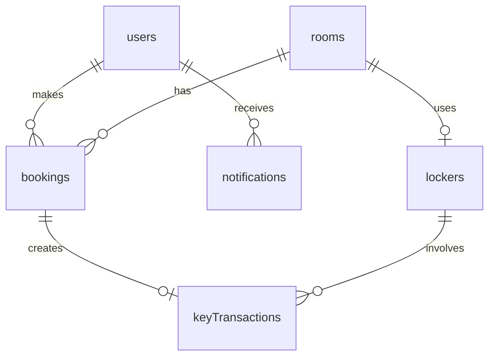

# Struktur Database Firestore

Dokumentasi struktur database untuk proyek Smart Room. Sistem ini menggunakan 6 collections utama pada Firebase Firestore.

## Diagram Relasi



---

## 1. `users`
Menyimpan data pengguna aplikasi (mahasiswa, dosen, atau admin).

- **Document ID**: Menggunakan `uid` dari Firebase Authentication.
- **Fields**:
  - `name` (String): Nama lengkap pengguna.
  - `email` (String): Alamat email pengguna.
  - `role` (String): Peran pengguna, enum: `"user"`, `"admin"`.
  - `createdAt` (Timestamp): Waktu pembuatan akun.

**Contoh Dokumen:**
```json
{
  "name": "Budi Santoso",
  "email": "budi@example.com",
  "role": "user",
  "createdAt": "2023-10-01T12:00:00Z"
}
```

---

## 2. `rooms`
Menyimpan data master ruangan yang dapat dipinjam.

- **Document ID**: Auto-generated by Firestore.
- **Fields**:
  - `name` (String): Nama/Kode ruangan (misal: "Ruang A101").
  - `capacity` (Number): Kapasitas maksimal orang di dalam ruangan.
  - `facilities` (Array of Strings): Daftar fasilitas (misal: `["Proyektor", "AC", "Papan Tulis"]`).
  - `status` (String): Status ruangan saat ini, enum: `"available"`, `"maintenance"`.
  - `createdAt` (Timestamp): Waktu data ditambahkan.

**Contoh Dokumen:**
```json
{
  "name": "Ruang A101",
  "capacity": 30,
  "facilities": ["Proyektor", "AC"],
  "status": "available",
  "createdAt": "2023-10-01T12:00:00Z"
}
```

---

## 3. `lockers`
Menyimpan data master loker fisik yang berisi kunci ruangan.

- **Document ID**: Auto-generated by Firestore.
- **Fields**:
  - `roomId` (String): Referensi ke Document ID dari collection `rooms`.
  - `esp32Id` (String): ID spesifik ESP32 yang terhubung ke loker ini.
  - `status` (String): Status pintu loker, enum: `"locked"`, `"unlocked"`.
  - `isKeyInside` (Boolean): Sensor apakah kunci fisik sedang berada di dalam loker.

**Contoh Dokumen:**
```json
{
  "roomId": "ROOM_DOC_ID_123",
  "esp32Id": "ESP32_NODE_01",
  "status": "locked",
  "isKeyInside": true
}
```

---

## 4. `bookings`
Transaksi permohonan peminjaman ruangan.

- **Document ID**: Auto-generated by Firestore.
- **Fields**:
  - `userId` (String): Referensi ke ID dari `users`.
  - `roomId` (String): Referensi ke ID dari `rooms`.
  - `date` (String): Tanggal peminjaman dengan format `YYYY-MM-DD`.
  - `startTime` (String): Waktu mulai dengan format `HH:MM`.
  - `endTime` (String): Waktu selesai dengan format `HH:MM`.
  - `status` (String): Status permohonan, enum: `"pending"`, `"approved"`, `"rejected"`, `"completed"`, `"cancelled"`.
  - `purpose` (String): Tujuan peminjaman ruangan.
  - `createdAt` (Timestamp): Waktu permohonan dibuat.

**Contoh Dokumen:**
```json
{
  "userId": "USER_UID_456",
  "roomId": "ROOM_DOC_ID_123",
  "date": "2023-10-15",
  "startTime": "08:00",
  "endTime": "10:00",
  "status": "pending",
  "purpose": "Rapat HIMA",
  "createdAt": "2023-10-10T09:30:00Z"
}
```

---

## 5. `keyTransactions`
Catatan mengenai pengambilan dan pengembalian kunci oleh pengguna.

- **Document ID**: Auto-generated by Firestore.
- **Fields**:
  - `bookingId` (String): Referensi ke ID dari `bookings`.
  - `userId` (String): Referensi ke ID dari `users`.
  - `pickupTime` (Timestamp): Waktu aktual kunci diambil dari loker (bisa null jika belum diambil).
  - `returnTime` (Timestamp): Waktu aktual kunci dikembalikan (bisa null jika belum kembali).
  - `status` (String): Status pergerakan kunci, enum: `"picked_up"`, `"returned"`.

**Contoh Dokumen:**
```json
{
  "bookingId": "BOOKING_DOC_ID_789",
  "userId": "USER_UID_456",
  "pickupTime": "2023-10-15T07:55:00Z",
  "returnTime": null,
  "status": "picked_up"
}
```

---

## 6. `notifications`
Sistem notifikasi yang dikirimkan ke pengguna.

- **Document ID**: Auto-generated by Firestore.
- **Fields**:
  - `userId` (String): Referensi ke ID `users` yang menerima notifikasi.
  - `title` (String): Judul notifikasi.
  - `message` (String): Pesan notifikasi (contoh: "Peminjaman ruang Anda disetujui").
  - `isRead` (Boolean): Status terbaca.
  - `createdAt` (Timestamp): Waktu notifikasi dibuat.

**Contoh Dokumen:**
```json
{
  "userId": "USER_UID_456",
  "title": "Booking Disetujui",
  "message": "Peminjaman Ruang A101 pada 2023-10-15 telah disetujui.",
  "isRead": false,
  "createdAt": "2023-10-10T15:00:00Z"
}
```

---

## Aturan Bisnis Dasar (Business Rules)
1. **Overlap Booking**: Sebuah `room` tidak dapat dibooking jika statusnya `approved` pada `date` dan rentang `startTime`-`endTime` yang bertabrakan.
2. **Key Access**: ESP32 hanya boleh membuka (unlock) loker jika terdapat transaksi peminjaman `approved` untuk ruangan yang sesuai dengan waktu yang valid (misalnya H-15 menit sebelum `startTime`).
3. **Data Integrity**: Menghapus `rooms` atau `users` tidak direkomendasikan jika terdapat historis `bookings`. Gunakan mekanisme soft delete (status inactive).

## Indexes yang Dibutuhkan
Agar aplikasi berjalan lancar, Anda harus melakukan setup index komposit. Silakan gunakan file `firestore.indexes.json` atau lihat konfigurasi pada repository ini untuk mendeploy index ke proyek Firebase Anda.
